# 🌌 九霄尋道 (Nine Heavens Cultivation)
> **基於 Java Swing 與 MySQL 構建的沉浸式修仙模擬 RPG**

《九霄尋道》是一款融合了 **文字養成**、**即時戰鬥動畫**與**天道管理體系**的 Java 開發專案。透過物件導向設計與資料庫持久化技術，模擬修士從「凡人」歷練至「大能」的完整修仙因果。

---

## 📸 仙途紀實 (System Showcases)

### 🎭 角色登入與創生

  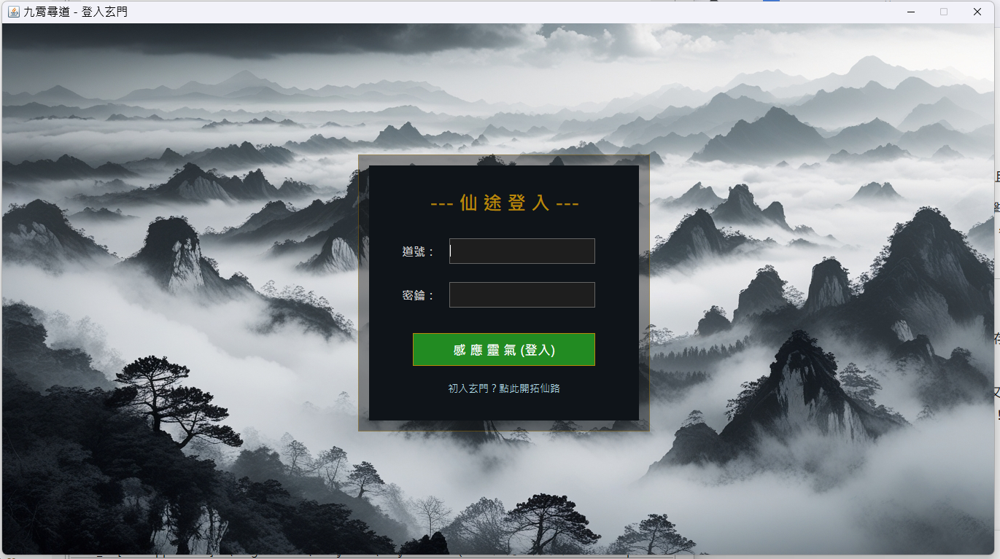
   
  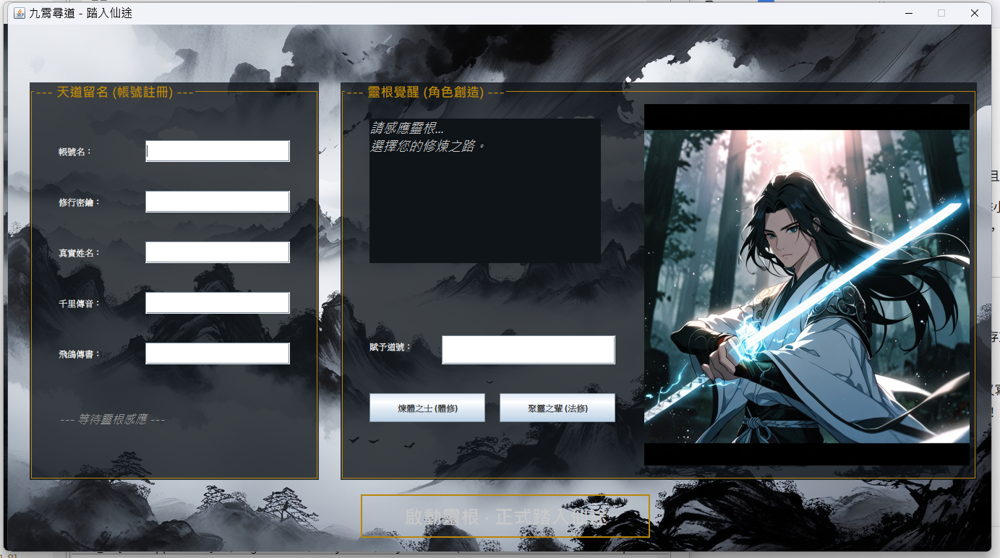
  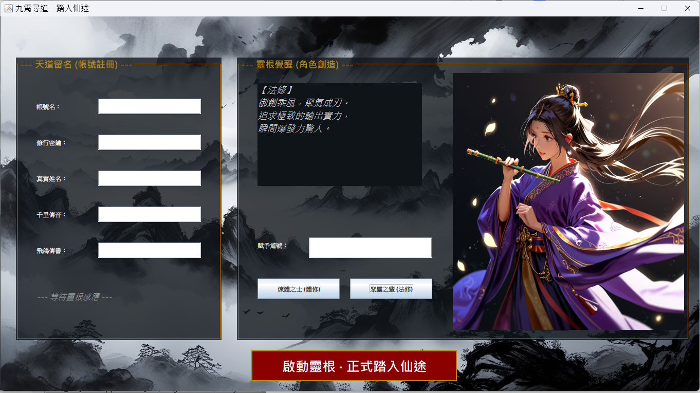
  
<i>由上至下：仙途入口、男女修士角色創建介面</i>

### ⚔️ 靈壓戰鬥與歷練

  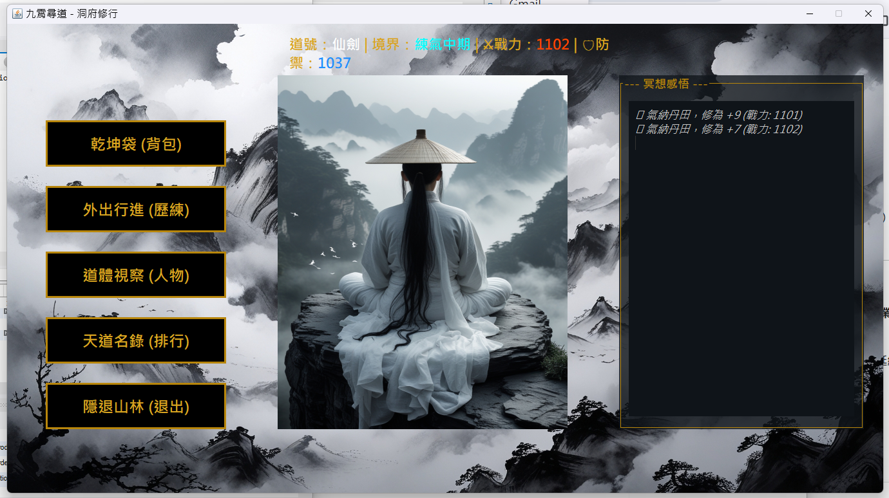
   
  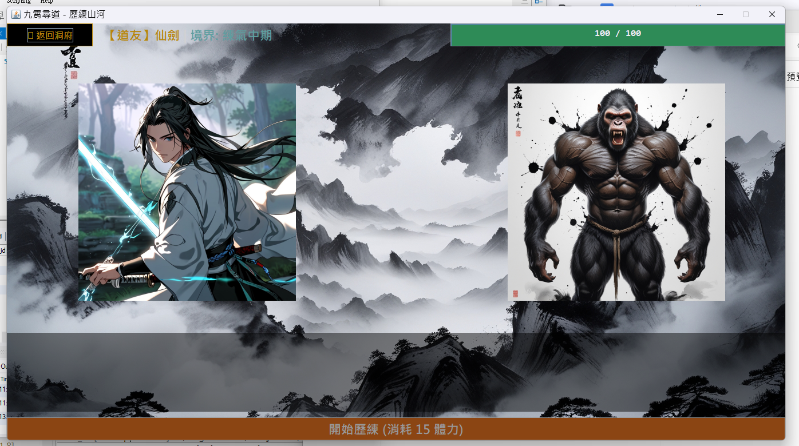
  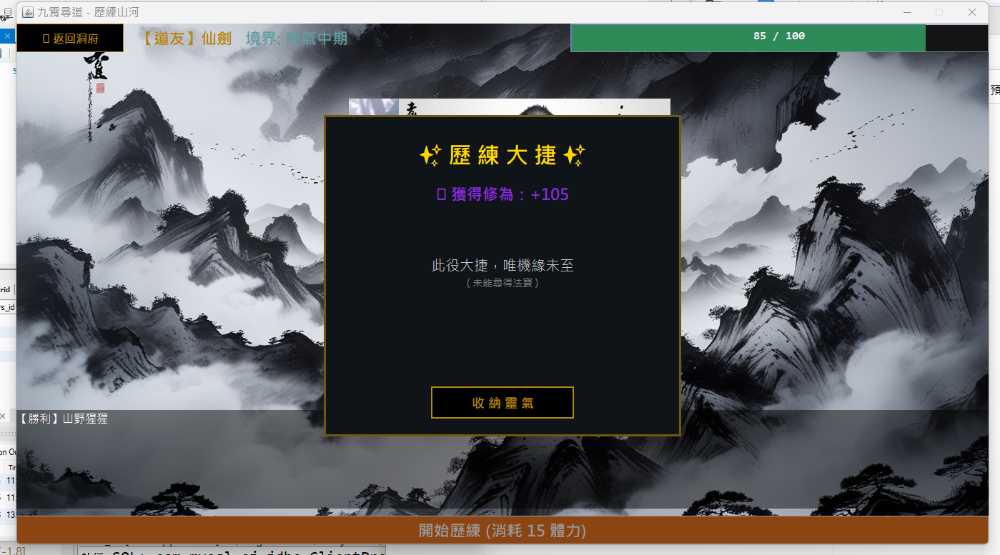
  
<i>主城地圖、水墨風對撞戰鬥系統及戰利品結算</i>

### 📦 乾坤袋與修士詳情

  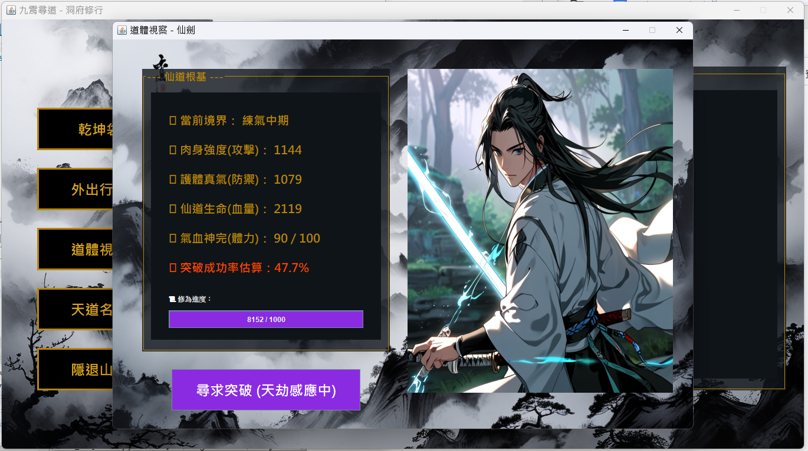
  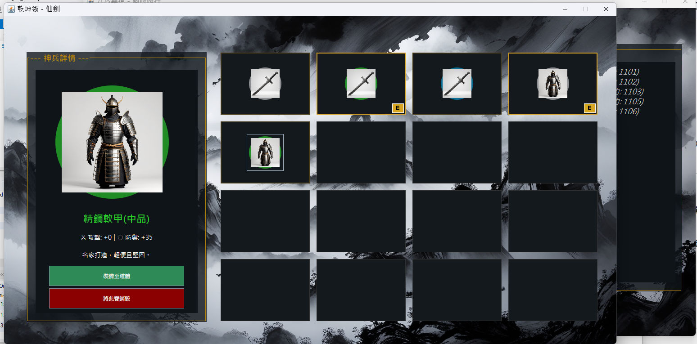
  
<i>修士屬性面板與乾坤袋（Inventory）管理系統</i>

### 🔱 天道管理宮 (Admin System)

  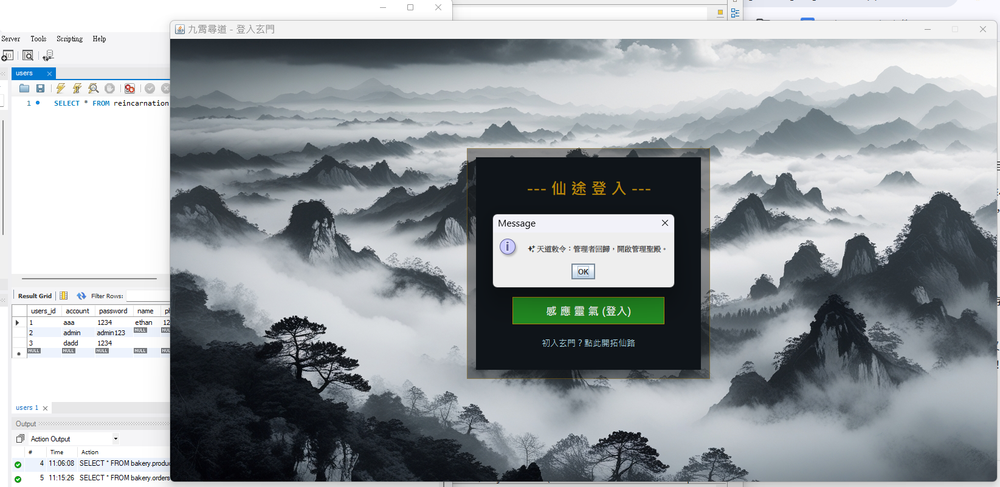
  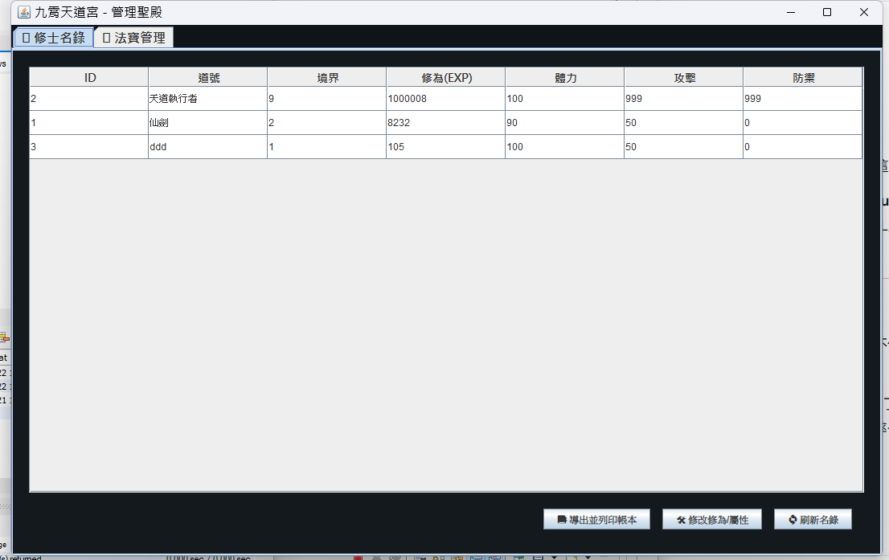
  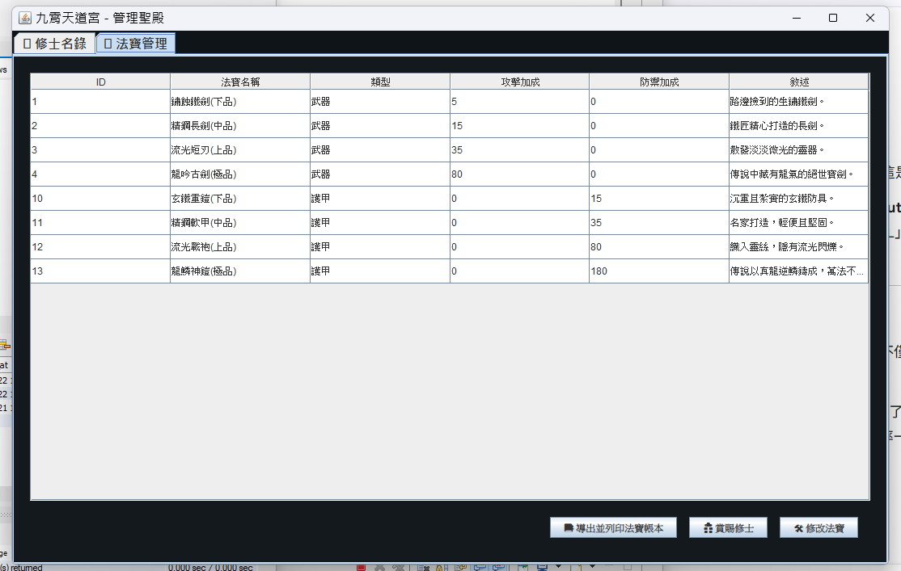
   
  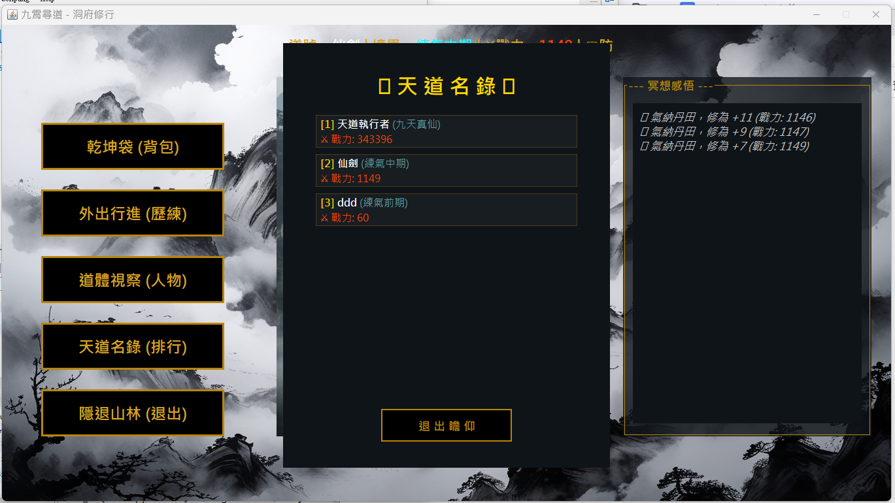
  
<i>天道管理後台：含修士帳號管理、法寶百科維護與全服公告系統</i>

---

## 💎 核心系統 (Core Systems)

### 1. ⚡ 雷劫渡劫與突破
* **視覺震撼**：突破時觸發全螢幕閃電特效與視窗抖動，模擬天道威壓。
* **動態門檻**：從資料庫 `realm_config` 實時讀取境界需求，實現隨等級遞增的修煉難度。

### 2. 📊 數據持久化技術
* **JDBC 批次處理**：優化背包與屬性同步，降低資料庫負擔。
* **天道帳本**：整合 **Apache POI**，支援全服修士數據導出至 Excel。

---

## 🛠️ 技術棧 (Technical Stack)

| 層級 | 技術實作 |
| :--- | :--- |
| **表現層 (View)** | Java Swing, AWT (Custom Graphics2D Rendering) |
| **業務層 (Service)** | OOP Logic, Multithreading (Stamina Recovery) |
| **持久層 (DAO)** | JDBC, MySQL 8.0, PreparedStatement |
| **工具整合** | Maven, Apache POI (Excel Export) |

---

## 🚀 快速開始 (Quick Start)

### 1. 資料庫初始化
請執行 `sql/init_reincarnation.sql` 建立核心表單：`characters` (修士)、`player_items` (背包)、`realm_config` (境界)。

### 2. 運行專案
執行 `src/main/java/view/Start_UI.java` 即可開啟仙途。

---

## 👨‍💻 開發者心得
本專案挑戰了 **Java Swing** 在遊戲開發中的極限，解決了 UI 刷新頻率同步（FPS）、數據異步持久化以及跨視窗物件傳遞等技術難點。展現了 Java 在構建複雜邏輯系統時的嚴謹性。

---

**願道友早日證得大道，九霄凌雲！**
